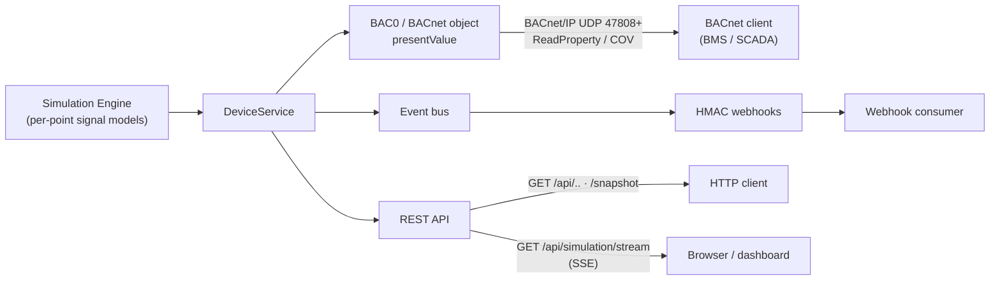

# API Reference

Base URL: `https://bacnet.tools.thefusionapps.com`

All examples below use this host. For local development, replace it with `http://localhost:8080`.

## Authentication

When `BACNET_LAB_AUTH_USERNAME` and `BACNET_LAB_AUTH_PASSWORD` are set, every endpoint requires HTTP Basic Auth. Add `-u <user>:<pass>` to each request:

```bash
curl -u admin:admin123 https://bacnet.tools.thefusionapps.com/api/health
```

If auth env vars are empty, the server runs open and `-u` can be omitted. The examples below include `-u admin:admin123` — change to your credentials.

## How clients consume data

Two live data paths plus the request/response REST surface:



- **BACnet/IP** — real BACnet clients read live `presentValue`s straight off the wire (one device per UDP port from 47808). No HTTP needed.
- **SSE** — `GET /api/simulation/stream` pushes a JSON snapshot every ~1s.
- **REST** — poll any endpoint below; `/api/simulation/snapshot` returns all current values in one flat list.
- **Webhooks** — HMAC-signed event push.

## Endpoint Summary

| Method | Path | Description |
|--------|------|-------------|
| GET | `/api/health` | Health check |
| GET | `/api/devices` | List all devices |
| GET | `/api/devices/{device_id}` | Device details with points |
| PUT | `/api/devices/{device_id}/points` | Write a point value by name |
| GET | `/api/scenarios` | List scenarios |
| POST | `/api/scenarios/{scenario_id}/start` | Start a scenario |
| POST | `/api/scenarios/{scenario_id}/stop` | Stop a scenario |
| GET | `/api/endpoints` | List webhook endpoints |
| POST | `/api/endpoints` | Create webhook endpoint |
| DELETE | `/api/endpoints/{endpoint_id}` | Delete webhook endpoint |
| POST | `/api/endpoints/{endpoint_id}/test` | Test webhook delivery |
| GET | `/api/events` | Recent events |
| GET | `/api/alarms` | Recent / active alarms |
| GET | `/api/simulation/status` | Engine status (clock, speed, world, models) |
| GET | `/api/simulation/generators` | Per-point signal model + current value |
| GET | `/api/simulation/snapshot` | All current point values (flat list) |
| GET | `/api/simulation/stream` | **SSE** live snapshot stream (~1s) |
| POST | `/api/simulation/start` | Start the engine |
| POST | `/api/simulation/stop` | Stop the engine |
| GET | `/api/simulation/faults` | List active faults |
| POST | `/api/simulation/faults` | Inject a fault |
| DELETE | `/api/simulation/faults` | Clear fault(s) |
| GET | `/api/history/{point}` | Time-series history (TimescaleDB) |
| GET | `/api/history/devices/latest` | Latest value per point, pivoted per device |
| GET | `/api/forecast/{point}` | Forecast a point (Chronos / naive) |
| GET | `/api/forecast/info` | Forecast model availability |
| GET | `/api/copilot/explain/{point}` | Grounded reasoning: forecast + why (LLM) |
| POST | `/api/copilot/ask` | Free-form question, optionally grounded on a point |
| GET | `/api/copilot/info` | Copilot / LLM availability |
| GET | `/metrics` | Prometheus metrics (no `/api` prefix) |

---

## Anomaly Detection

The system automatically monitors real-time point values against their latest forecasts. If a value drifts outside the probabilistic forecast interval (**P10-P90**), an anomaly is detected and an alarm is raised.

- **Trigger:** Any `point_value_changed` event.
- **Logic:** Compares current value to the forecast step closest to the current time.
- **Action:** Publishes an `alarm_raised` event with `severity: medium`.
- **Thresholds:** Uses the P10 (lower bound) and P90 (upper bound) quantiles from the latest forecast stored in the database.

Clients can listen for these anomalies via webhooks (event type `alarm_raised`) or poll the `/api/alarms` endpoint.

---

## Health

### GET /api/health

```bash
curl -u admin:admin123 https://bacnet.tools.thefusionapps.com/api/health
```

Response `200`:

```json
{
  "status": "ok",
  "version": "0.1.0",
  "devices_count": 8,
  "active_scenarios": 0
}
```

---

## Devices

### GET /api/devices

List all devices (summary, no points).

```bash
curl -u admin:admin123 https://bacnet.tools.thefusionapps.com/api/devices
```

Response `200`:

```json
[
  {
    "device_id": 1001,
    "name": "AHU-01",
    "description": "Air Handling Unit",
    "status": "online",
    "point_count": 12
  }
]
```

### GET /api/devices/{device_id}

Full device detail with all points.

```bash
curl -u admin:admin123 https://bacnet.tools.thefusionapps.com/api/devices/1001
```

Response `200`:

```json
{
  "device_id": 1001,
  "name": "AHU-01",
  "description": "Air Handling Unit",
  "status": "online",
  "points": [
    {
      "object_type": "analogInput",
      "object_instance": 1,
      "object_name": "SupplyAirTemp",
      "description": "Supply air temperature",
      "present_value": 22.5,
      "units": "degreesCelsius"
    }
  ]
}
```

`404` if device not found: `{"detail": "Device not found"}`

### PUT /api/devices/{device_id}/points

Write a point value by point name.

Body:

| Field | Type | Description |
|-------|------|-------------|
| `point_name` | string | Object name of the point (e.g. `SupplyAirTemp`) |
| `value` | number / bool / string | New present value |

```bash
curl -u admin:admin123 -X PUT \
  https://bacnet.tools.thefusionapps.com/api/devices/1001/points \
  -H "Content-Type: application/json" \
  -d '{"point_name": "SupplyAirTemp", "value": 24.5}'
```

Response `200`: `{"status": "ok"}`

`404` if device or point not found.

---

## Scenarios

Scenario IDs: `hvac_day_cycle`, `alarm_cycle`, `device_offline`, `manual_override`.

### GET /api/scenarios

```bash
curl -u admin:admin123 https://bacnet.tools.thefusionapps.com/api/scenarios
```

Response `200`:

```json
[
  {
    "id": "hvac_day_cycle",
    "name": "HVAC Day/Night Cycle",
    "description": "Compressed 24h HVAC simulation",
    "status": "stopped"
  }
]
```

### POST /api/scenarios/{scenario_id}/start

Optional JSON body `{"params": {...}}` — params are scenario-specific.

```bash
curl -u admin:admin123 -X POST \
  https://bacnet.tools.thefusionapps.com/api/scenarios/hvac_day_cycle/start \
  -H "Content-Type: application/json" \
  -d '{"params": {"cycle_seconds": 60, "interval": 2}}'
```

Start with no params (uses defaults):

```bash
curl -u admin:admin123 -X POST \
  https://bacnet.tools.thefusionapps.com/api/scenarios/alarm_cycle/start
```

Response `200`:

```json
{
  "id": "hvac_day_cycle",
  "name": "HVAC Day/Night Cycle",
  "description": "Compressed 24h HVAC simulation",
  "status": "running"
}
```

`404` if scenario ID unknown.

### POST /api/scenarios/{scenario_id}/stop

```bash
curl -u admin:admin123 -X POST \
  https://bacnet.tools.thefusionapps.com/api/scenarios/hvac_day_cycle/stop
```

Response `200`: same shape as start, `status: "stopped"`.

---

## Webhook Endpoints

Event types: `point_value_changed`, `device_status_changed`, `alarm_raised`, `alarm_cleared`, `scenario_started`, `scenario_stopped`, `telemetry_snapshot`.

### GET /api/endpoints

```bash
curl -u admin:admin123 https://bacnet.tools.thefusionapps.com/api/endpoints
```

Response `200`:

```json
[
  {
    "id": "a1b2c3",
    "url": "https://example.com/webhook",
    "secret": "whsec_...",
    "enabled": true,
    "event_types": ["alarm_raised", "alarm_cleared"],
    "failure_count": 0
  }
]
```

### POST /api/endpoints

Body:

| Field | Type | Description |
|-------|------|-------------|
| `url` | string | Destination URL |
| `event_types` | string[] / null | Filter to these event types; `null` = all events |

```bash
curl -u admin:admin123 -X POST \
  https://bacnet.tools.thefusionapps.com/api/endpoints \
  -H "Content-Type: application/json" \
  -d '{"url": "https://example.com/webhook", "event_types": ["alarm_raised", "alarm_cleared"]}'
```

Response `201`: the created endpoint (includes generated `id` and `secret`). The `secret` signs each delivery via an HMAC-SHA256 signature header.

### DELETE /api/endpoints/{endpoint_id}

```bash
curl -u admin:admin123 -X DELETE \
  https://bacnet.tools.thefusionapps.com/api/endpoints/a1b2c3
```

Response `204` No Content.

### POST /api/endpoints/{endpoint_id}/test

Send a test payload to verify delivery.

```bash
curl -u admin:admin123 -X POST \
  https://bacnet.tools.thefusionapps.com/api/endpoints/a1b2c3/test
```

Response `200`: `{"status": "ok"}`
`502` if delivery failed: `{"detail": "Delivery failed"}`

---

## Events

### GET /api/events

Query params: `limit` (default `50`).

```bash
curl -u admin:admin123 "https://bacnet.tools.thefusionapps.com/api/events?limit=100"
```

Response `200`:

```json
[
  {
    "id": "e1f2g3",
    "event_type": "alarm_raised",
    "timestamp": "2026-06-09T12:00:00",
    "payload": {"device_id": 1001, "point_name": "SupplyAirTemp"},
    "delivered": true
  }
]
```

---

## Alarms

### GET /api/alarms

Query params:

| Param | Type | Default | Description |
|-------|------|---------|-------------|
| `active_only` | bool | `false` | Only currently-active (uncleared) alarms |
| `limit` | int | `50` | Max rows (ignored when `active_only=true`) |

Severity values: `low`, `medium`, `high`, `critical`.

```bash
curl -u admin:admin123 \
  "https://bacnet.tools.thefusionapps.com/api/alarms?active_only=true"
```

Response `200`:

```json
[
  {
    "id": "al1b2c",
    "device_id": 1001,
    "point_name": "SupplyAirTemp",
    "severity": "high",
    "message": "High supply air temperature",
    "raised_at": "2026-06-09T12:00:00",
    "cleared_at": null
  }
]
```

---

## Simulation Engine

The always-on engine drives every point through a signal model (continuous real-time data, no manual start). All behavior is env-tunable (`BACNET_LAB_SIM_*` — see [realtime-simulation-architecture.md](realtime-simulation-architecture.md)).

### GET /api/simulation/status

```bash
curl -u admin:admin123 https://bacnet.tools.thefusionapps.com/api/simulation/status
```

Response `200`:

```json
{
  "enabled": true,
  "running": true,
  "tick_hz": 1.0,
  "speed": 60.0,
  "seed": null,
  "noise_level": 1.0,
  "tick_count": 238,
  "sim_seconds": 14280.0,
  "sim_hour": 3.96,
  "generator_count": 55,
  "models": ["constant","derived","first_order_lag","gaussian_noise","multistate_cycle","pid_actuator","ramp","random_walk","sine","square","step","world_var"],
  "world_enabled": true,
  "world_state": {"outdoor_temp": 12.3, "zone_temp": 21.0, "zone_co2": 420.0, "zone_humidity": 45.0, "occupancy": 0.0},
  "faults_enabled": false,
  "active_faults": []
}
```

### GET /api/simulation/generators

Per-point generator binding + current value.

```bash
curl -u admin:admin123 https://bacnet.tools.thefusionapps.com/api/simulation/generators
```

```json
[
  {"key": "1001/AHU-01/SupplyAirTemp", "device_id": 1001, "point_name": "AHU-01/SupplyAirTemp",
   "object_type": "analogInput", "model": "first_order_lag", "value": 22.05}
]
```

### GET /api/simulation/snapshot

All current point values across all devices, one flat list.

```bash
curl -u admin:admin123 https://bacnet.tools.thefusionapps.com/api/simulation/snapshot
```

```json
[
  {"device_id": 1001, "device_name": "AHU-01", "point_name": "AHU-01/SupplyAirTemp",
   "object_type": "analogInput", "value": 22.05, "units": "degreesCelsius"}
]
```

### GET /api/simulation/stream  (Server-Sent Events)

`text/event-stream`. Emits a JSON snapshot (same shape as `/snapshot`) every ~1s until the client disconnects. Each message: `data: <json>\n\n`.

```bash
curl -N -u admin:admin123 https://bacnet.tools.thefusionapps.com/api/simulation/stream
```

Browser:

```javascript
const es = new EventSource("/api/simulation/stream");  // send Basic Auth via the page session
es.onmessage = (e) => { const points = JSON.parse(e.data); /* update UI */ };
```

### POST /api/simulation/start · /stop

```bash
curl -u admin:admin123 -X POST https://bacnet.tools.thefusionapps.com/api/simulation/start
curl -u admin:admin123 -X POST https://bacnet.tools.thefusionapps.com/api/simulation/stop
```

Response `200`: the engine status object.

---

## Fault Injection

Inject anomalies to exercise alarm/monitoring downstream. Kinds: `stuck`, `spike`, `drift`, `offline`, `noise_burst`. `duration_s: 0` = indefinite.

### POST /api/simulation/faults

| Field | Type | Description |
|-------|------|-------------|
| `point_key` | string | `"<device_id>/<object_name>"`, e.g. `1001/AHU-01/SupplyAirTemp` |
| `kind` | string | `stuck` / `spike` / `drift` / `offline` / `noise_burst` |
| `duration_s` | number | seconds (0 = indefinite) |
| `params` | object | kind-specific (e.g. `{"magnitude": 10}`) |

```bash
curl -u admin:admin123 -X POST \
  https://bacnet.tools.thefusionapps.com/api/simulation/faults \
  -H "Content-Type: application/json" \
  -d '{"point_key":"1001/AHU-01/SupplyAirTemp","kind":"stuck","duration_s":0}'
```

Response `200`: `{"active_faults": [ ... ]}`

### GET /api/simulation/faults

```bash
curl -u admin:admin123 https://bacnet.tools.thefusionapps.com/api/simulation/faults
```

### DELETE /api/simulation/faults

Clear all, or one with `?point_key=`.

```bash
curl -u admin:admin123 -X DELETE https://bacnet.tools.thefusionapps.com/api/simulation/faults
```

Response `200`: `{"cleared": 1, "active_faults": []}`

---

## Metrics

### GET /metrics

Prometheus exposition (no `/api` prefix, no trailing JSON).

```bash
curl -u admin:admin123 https://bacnet.tools.thefusionapps.com/metrics
```

```
# TYPE bacnet_sim_tick_total counter
bacnet_sim_tick_total 238
# TYPE bacnet_sim_writes_total counter
bacnet_sim_writes_total 12940
# TYPE bacnet_sim_generators gauge
bacnet_sim_generators 55
# TYPE bacnet_sim_running gauge
bacnet_sim_running 1
# TYPE bacnet_sim_active_faults gauge
bacnet_sim_active_faults 0
# TYPE bacnet_sim_seconds gauge
bacnet_sim_seconds 14280.0
```

---

## History (TimescaleDB)

Every point is sampled on a regular grid (default 5s) into TimescaleDB, with 1m/15m/1h continuous-aggregate rollups. Requires `BACNET_LAB_TSDB_ENABLED=true`.

### GET /api/history/{point}

Time series for one point. `point` is the object name, e.g. `AHU-01/SupplyAirTemp`.

| Param | Type | Default | Description |
|-------|------|---------|-------------|
| `res` | string | `1m` | `raw` · `1m` · `15m` · `1h` |
| `from` | ISO-8601 | now − 1h | window start |
| `to` | ISO-8601 | now | window end |
| `limit` | int | 5000 | max rows (≤ 20000) |

```bash
curl -u admin:admin123 \
  "https://bacnet.tools.thefusionapps.com/api/history/AHU-01/SupplyAirTemp?res=1m&limit=3"
```

Response `200` (aggregated resolutions return avg/min/max/last/n; `raw` returns `value`):

```json
{
  "object_name": "AHU-01/SupplyAirTemp",
  "resolution": "1m",
  "from": "2026-06-10T08:35:00+00:00",
  "to": "2026-06-10T09:35:00+00:00",
  "count": 3,
  "points": [
    {"time": "2026-06-10T08:35:00+00:00", "avg": 21.99, "min": 21.82, "max": 22.15, "last": 21.88, "n": 12}
  ]
}
```

### GET /api/history/devices/latest

Latest value of every point per device, pivoted into a JSON object (read-time pivot — no schema change when points change).

```bash
curl -u admin:admin123 https://bacnet.tools.thefusionapps.com/api/history/devices/latest
```

```json
[
  {"device_id": 1001, "name": "AHU-01",
   "points": {"AHU-01/SupplyAirTemp": 22.05, "AHU-01/CoolingValve": 0.67, "AHU-01/FilterDirty": false}}
]
```

---

## Forecast

Zero-shot time-series forecast per point. Uses **Chronos** (`amazon/chronos-bolt-small`) when torch is installed, else a naive persistence+drift fallback — same response shape either way. Reads history directly from TimescaleDB; stores forecasts in a `forecast` hypertable.

### GET /api/forecast/info

```bash
curl -u admin:admin123 https://bacnet.tools.thefusionapps.com/api/forecast/info
```

```json
{"model_name": "amazon/chronos-bolt-small", "chronos_available": true, "db_ready": true,
 "resolutions": ["1m","15m","1h","raw"]}
```

`chronos_available: false` → naive fallback is in use (install torch + chronos to enable the real model).

### GET /api/forecast/{point}

| Param | Type | Default | Description |
|-------|------|---------|-------------|
| `res` | string | `1m` | history resolution to read |
| `horizon` | int | 12 | steps ahead (1–288) |
| `lookback_s` | int | 3600 | history window fed to the model |
| `store` | bool | true | persist the forecast |

```bash
curl -u admin:admin123 \
  "https://bacnet.tools.thefusionapps.com/api/forecast/AHU-01/SupplyAirTemp?res=1m&horizon=6"
```

Response `200` — probabilistic forecast (p10/p50/p90 per step):

```json
{
  "object_name": "AHU-01/SupplyAirTemp",
  "model": "amazon/chronos-bolt-small",
  "made_at": "2026-06-10T09:38:32+00:00",
  "resolution": "1m",
  "horizon": 6,
  "forecast": [
    {"time": "2026-06-10T09:36:00+00:00", "p10": 21.75, "p50": 22.03, "p90": 22.31}
  ]
}
```

`model` is `"naive"` when Chronos is unavailable. Verify the model end-to-end (accuracy vs persistence baseline + interval coverage) with:

```bash
docker compose exec -T bacnet-lab python - < scripts/verify_forecast.py
```

---

## Copilot (grounded reasoning)

Combines three layers: **Chronos** (what will happen) + **TimescaleDB evidence** (why — measured deltas of related points and recent events) + an **LLM** (narration). The LLM receives only the computed numbers and is instructed to cite them — it never invents values. Requires `BACNET_LAB_LLM_ENABLED=true` and an Open-WebUI / Ollama endpoint (`BACNET_LAB_LLM_*`). If the LLM is unreachable, a deterministic fallback builds the same prediction+reason from the evidence.

### GET /api/copilot/info

```bash
curl -u admin:admin123 https://bacnet.tools.thefusionapps.com/api/copilot/info
```

```json
{"enabled": true, "llm_model": "llama3.1:8b",
 "base_url": "https://ollamallm.tools.thefusionapps.com", "db_ready": true}
```

### GET /api/copilot/explain/{point}

Forecast a point and explain the likely cause using the largest recent driver changes on the same device.

| Param | Type | Default | Description |
|-------|------|---------|-------------|
| `horizon` | int | 6 | forecast steps ahead (1–288) |
| `res` | string | `1m` | history resolution |
| `window_s` | int | 1800 | evidence window for driver deltas |

```bash
curl -u admin:admin123 \
  "https://bacnet.tools.thefusionapps.com/api/copilot/explain/AHU-01/SupplyAirTemp?horizon=6&window_s=1800"
```

Response `200`:

```json
{
  "object_name": "AHU-01/SupplyAirTemp",
  "predicted_value": 22.28,
  "units": "degreesCelsius",
  "horizon": "6 min",
  "forecast": {"horizon": "6 min", "p10": 20.31, "p50": 22.28, "p90": 24.57},
  "answer": "Prediction: AHU-01/SupplyAirTemp ≈ 22.28degreesCelsius in 6 min (range 20.31–24.57)\nReason:\n- AHU-01/HeatingValve: 6.208→0.312 (-5.896percent)\n- AHU-01/MixedAirTemp: 21.151→23.873 (+2.722degreesCelsius)\n- AHU-01/FanSpeed: 76.112→73.55 (-2.562percent)",
  "evidence": {
    "target": {"point": "AHU-01/SupplyAirTemp", "current": 22.0, "delta": 0.1, "units": "degreesCelsius"},
    "forecast": {"horizon": "6 min", "p10": 20.31, "p50": 22.28, "p90": 24.57},
    "drivers": [
      {"point": "AHU-01/HeatingValve", "old": 6.208, "new": 0.312, "delta": -5.896, "units": "percent"}
    ],
    "events": [{"time": "2026-06-11T09:41:59+00:00", "type": "alarm_raised", "severity": "high"}]
  },
  "llm_model": "llama3.1:8b",
  "grounded": true,
  "forecast_model": "amazon/chronos-bolt-small",
  "device_id": 1001
}
```

`answer` is the human-facing prediction + reasons; `evidence` is the raw grounding data (audit trail — every number in `answer` traces back here).

### POST /api/copilot/ask

Free-form question. Pass `object_name` to ground the answer on that point's forecast + evidence.

| Field | Type | Description |
|-------|------|-------------|
| `question` | string | the user's question |
| `object_name` | string / null | optional point to ground on |

```bash
curl -u admin:admin123 -X POST \
  https://bacnet.tools.thefusionapps.com/api/copilot/ask \
  -H "Content-Type: application/json" \
  -d '{"question": "Will the supply air overheat soon?", "object_name": "AHU-01/SupplyAirTemp"}'
```

Response `200`: `{"answer": "...", "llm_model": "llama3.1:8b", "object_name": "AHU-01/SupplyAirTemp"}`
